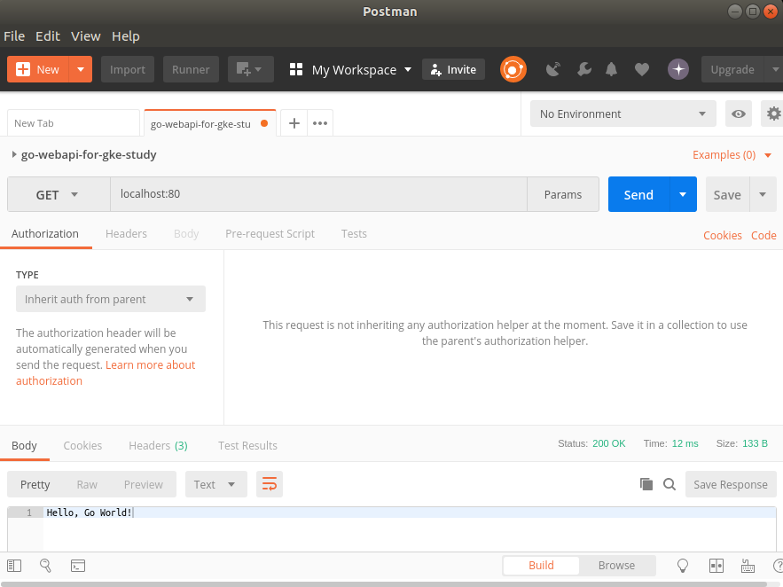

# go-webapi-for-gke-study

## env

### # OS
<pre>
$ cat /etc/os-release 
NAME="Ubuntu"
VERSION="17.10 (Artful Aardvark)"
</pre>

### # Golang
<pre>
$ go version
go version go1.10 linux/amd64
</pre>

### # Docker
<pre>
$ sudo docker version
Client:
 Version:           18.06.1-ce
 API version:       1.38
 Go version:        go1.10.3
 Git commit:        e68fc7a
 Built:             Tue Aug 21 17:25:03 2018
 OS/Arch:           linux/amd64
 Experimental:      false

Server:
 Engine:
  Version:          18.06.1-ce
  API version:      1.38 (minimum version 1.12)
  Go version:       go1.10.3
  Git commit:       e68fc7a
  Built:            Tue Aug 21 17:23:27 2018
  OS/Arch:          linux/amd64
  Experimental:     false
</pre>

### # gcloud
<pre>
$ gcloud version
Google Cloud SDK 216.0.0
app-engine-go 
app-engine-java 1.9.64
app-engine-python 1.9.75
beta 2018.07.16
bigtable 
bq 2.0.34
cbt 
cloud-build-local 
cloud-datastore-emulator 2.0.2
cloud_sql_proxy 
container-builder-local 
core 2018.09.07
docker-credential-gcr 
gsutil 4.33
kubectl 2018.08.17
pubsub-emulator 2018.02.02
</pre>

## web framework

### echo
https://echo.labstack.com/

## docker build
<pre>
$ sudo docker build -t sky0621/go-webapi-for-gke-study:v0.1 .
Sending build context to Docker daemon  6.675MB
Step 1/10 : FROM "sky0621dhub/dockerfile-gowithdep" AS builder
 ---> 34ac64e9d330
Step 2/10 : COPY . /go/src/github.com/sky0621/go-webapi-for-gke-study
 ---> c849642eda5d
Step 3/10 : WORKDIR /go/src/github.com/sky0621/go-webapi-for-gke-study
 ---> Running in 4d7fc8ed246f
Removing intermediate container 4d7fc8ed246f
 ---> 1fc4e493dccd
Step 4/10 : RUN dep ensure
 ---> Running in 80e12ada08ba
Removing intermediate container 80e12ada08ba
 ---> 5b87dcf45beb
Step 5/10 : RUN go test ./...
 ---> Running in 094a6c185bbe
?   	github.com/sky0621/go-webapi-for-gke-study	[no test files]
Removing intermediate container 094a6c185bbe
 ---> 8eaea36ad745
Step 6/10 : RUN CGO_ENABLED=0 go build -o go-webapi-for-gke-study github.com/sky0621/go-webapi-for-gke-study
 ---> Running in 167eb50e01f0
Removing intermediate container 167eb50e01f0
 ---> 5c950d0e57c0
Step 7/10 : FROM scratch
 ---> 
Step 8/10 : COPY --from=builder /go/src/github.com/sky0621/go-webapi-for-gke-study/ .
 ---> e3f3efd1e244
Step 9/10 : EXPOSE 80
 ---> Running in 821d3bc99430
Removing intermediate container 821d3bc99430
 ---> 13b86f517dde
Step 10/10 : ENTRYPOINT [ "./go-webapi-for-gke-study" ]
 ---> Running in dad600e6aa43
Removing intermediate container dad600e6aa43
 ---> 29c44a061658
Successfully built 29c44a061658
Successfully tagged sky0621/go-webapi-for-gke-study:v0.1
</pre>

## docker images
<pre>
$ sudo docker images
REPOSITORY                         TAG                 IMAGE ID            CREATED             SIZE
sky0621/go-webapi-for-gke-study    v0.1                29c44a061658        6 seconds ago       14MB
</pre>

## docker run
<pre>
$ sudo docker run -p 80:80 sky0621/go-webapi-for-gke-study:v0.1

   ____    __
  / __/___/ /  ___
 / _// __/ _ \/ _ \
/___/\__/_//_/\___/ v3.3.6
High performance, minimalist Go web framework
https://echo.labstack.com
____________________________________O/_______
                                    O\
⇨ http server started on [::]:80
</pre>

## access by postman
https://www.getpostman.com/apps


<pre>
{"level":"info","ts":1536766652.7998405,"caller":"go-webapi-for-gke-study/main.go:21","msg":"INFO LEVEL with severity","severity":"INFO"}
</pre>

## Other build

### Cloud Build

```
$ gcloud builds submit --config cloudbuild.yaml .
Creating temporary tarball archive of 11 file(s) totalling 78.0 KiB before compression.
Some files were not included in the source upload.
　〜省略〜
DONE
------------------------------------------------------------------------------------------------------------------------------------------------------------------------------------------------------------

ID                                    CREATE_TIME                DURATION  SOURCE                                                                                  IMAGES                                                 STATUS
0cb8242b-d6c1-4044-adc1-535f23ab46f8  2018-09-24T12:33:30+00:00  1M45S     gs://【プロジェクトID】_cloudbuild/source/1537792407.93-c60debfd6404421a956da8e7bb525673.tgz  gcr.io/【プロジェクトID】/go-webapi-for-gke-study (+1 more)  SUCCESS
```

## docker login -> push

sudo docker login

sudo docker push sky0621dhub/go-webapi-for-gke-study
